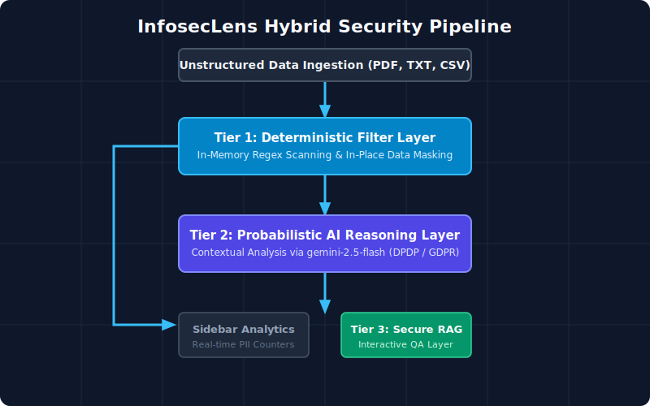

# 🛡️ InfosecLens: Sensitive Data Detection & Compliance Assistant

A hybrid security pipeline engineered to ingest unstructured documents, systematically mask high-risk structured personal data using localized low-latency components, and utilize advanced Large Language Models (LLMs) to perform regulatory and abstract compliance risk reasoning.

---

## 🔗 Live Deployment
* **Working Prototype Deployment:** [Live Hugging Face Space Link](https://huggingface.co/spaces/PSwasti/InfosecLens)

---

## 🚀 Architecture Overview
The system implements a decoupled, multi-tier **Hybrid Security Processing Framework** designed to maximize security, isolate network-dependent tasks, and optimize the context window before inference.



1. **Deterministic Filter Layer (Local Inference):** Utilizes compiled, in-memory regular tracking expressions to perform immediate matching and metadata collection on structured identifiers (Emails, Phone Numbers, PAN Cards, Aadhaar Cards, Credit Cards, explicit database credentials) with zero external network overhead.
2. **Data Masking Engine:** Intercepts matches in real-time, masking sensitive data arrays with specialized `[REDACTED]` tokens to visualize a clean string output view.
3. **Probabilistic Reasoning Layer (Contextual AI):** Feeds the pre-parsed text payload safely to the `gemini-2.5-flash` model, driving semantic analysis to surface implicit operational risks (e.g., hidden business intent, vulnerable trade strategies) and automatically maps findings against structural global frameworks like the **India DPDP Act (2023)** and **GDPR**.
4. **Secure QA RAG Layer:** Runs a real-time retrieval window directly over the document segment within a secure layout tab, processing localized validation questions instantly.

---

## 🧠 AI/ML & Engineering Approach
* **Deterministic vs. Probabilistic Balancing:** Rather than wasting heavy network token overhead on scanning raw strings for basic regex-matching patterns, structural entities are handled using immediate regex matching. The LLM is strictly reserved for high-level semantic risk mapping, compliance taxonomy, and remediation generation.
* **Context Preservation & Token Optimization:** The pipeline implements rigorous string slicing limits (`text[:4000]`) to act as an aggressive fallback barrier against token-budget blowouts and prevent out-of-memory errors on unstructured enterprise logs.
* **Environment Sandboxing:** Built as a standalone virtual container via a custom `Dockerfile` on python-slim frameworks to enforce immutable environment layers, ensuring cross-platform stability between localized testing environments and cloud hosting layers.

---

## 🛑 Key Technical Challenges & Mitigation
* **Upstream Rate Overloads (Google API 503):** During intense cluster spikes on the public free tier, the inference API returned a transient `503 Service Unavailable` error, causing layout crashes.
  * *Mitigation:* Engineered deep `try-except` fallback handling around the `Client` calling routines. If the AI model stalls or rate-limits, the system falls back gracefully to a polished UI warning that presents **Deterministic Layer Backup Logs**, proving the local security regex engine remains online even if external cloud layers experience down-times.
* **Unpack Value Crashing (Signature Matching):** An initial error handler inconsistency caused an operational payload variance when returning tuples to the runtime matrix.
  * *Mitigation:* Standardized the return signatures across both execution conditions to strictly return exactly two items, completely stabilizing the stream.

---

## 🛠️ Local Setup Instructions

### 1. Clone the Repository
```bash
git clone [https://github.com/](https://github.com/)<your-username>/InfosecLens.git
cd InfosecLens
python3 -m venv venv
source venv/bin/activate  # On Windows use: venv\Scripts\activate
pip install -r requirements.txt
export GEMINI_API_KEY="your-actual-api-key-string"
streamlit run app.py
